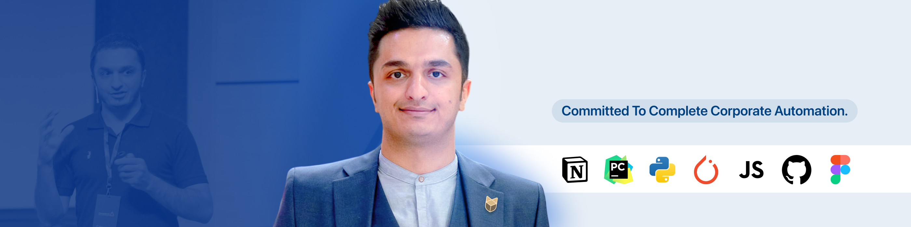

- 🌍 Open source empowers global innovation.
- 💡 Coding since 9, fueled by curiosity.
- 📚 Avid reader of AI and ML papers.

---
#### Mathew 👋🏾 👨🏽‍💻 with only 1 T
&nbsp;
My dad gave me a computer in 1997 and my late aunt and uncle helped me coding. ⁤⁤making things easier and better is big part of my life. ⁤I believe coding skills are essential for all. it's about improving any area. ⁤⁤My focus is on AI and machine learning to increase productivity, aiming to benefit everyone.

&nbsp;
When I open-source projects, it's not just about code. I also share my business ideas. Look in the **"business"** folder in my projects. You'll find ideas and plans. If you have a team and some money for marketing, you could start a business with these ideas. Do you need to pay me? No. I love creating and making the world better. 

**Skills:**
- 🐍 Expert in Python for AI and machine learning, with a strong coding background.
- 🔍 Skilled in data analysis and automation to enhance productivity.
- 🌟 Visionary leader adept at fostering innovation, team collaboration, and strategic planning to align technology initiatives with business goals.
